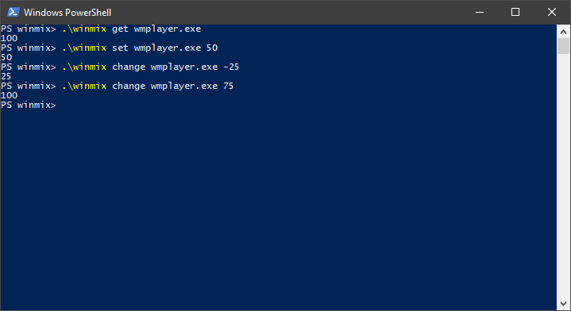

# winmix [](https://ci.appveyor.com/project/medusalix/winmix) [](https://github.com/medusalix/winmix/releases/latest)



winmix is a command-line utility that lets you **change the volume of individual applications** under *Windows*. It can be used to create **mouse macros** or **scripts**.

## Usage

There are a number of commands that can be passed to winmix. The following table contains the possible commands and their usage:

| Command                        | Description                                                                                              |
|--------------------------------|----------------------------------------------------------------------------------------------------------|
| get \<process-name>             | Gets the volume of the specified process and prints it.                                                  |
| set \<process-name> \<volume>    | Sets the volume of the specified process (in the range of 0 to 100) and prints the set volume.           |
| change \<process-name> \<volume> | Changes the volume of the specified process (in the range of -100 to 100) and prints the changed volume. |

**NOTE:** *The `process-name` is **case-sensitive***.

## Examples

There is a variety of different use cases for winmix, for example:

#### Windows Media Player

```
winmix set wmplayer.exe 50
```

#### Google Chrome

```
winmix set chrome.exe 50
```

#### Discord

```
winmix set Discord.exe 50
```

## Building

You can download winmix via the following command:

```
go get github.com/medusalix/winmix
```

A list of prebuilt binaries can be found [here](https://github.com/medusalix/winmix/releases).

## License

winmix is released under the [Apache 2.0 license](LICENSE).

```
Copyright (C) 2019 Medusalix

Licensed under the Apache License, Version 2.0 (the "License");
you may not use this file except in compliance with the License.
You may obtain a copy of the License at

    http://www.apache.org/licenses/LICENSE-2.0

Unless required by applicable law or agreed to in writing, software
distributed under the License is distributed on an "AS IS" BASIS,
WITHOUT WARRANTIES OR CONDITIONS OF ANY KIND, either express or implied.
See the License for the specific language governing permissions and
limitations under the License.
```
